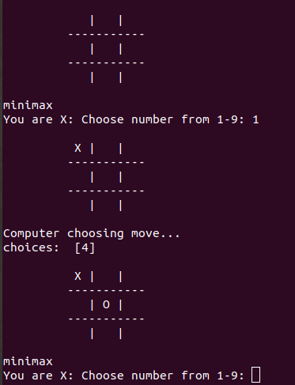

# TICTACTOE

Have two players:
- We
- Computer

In this program we implement algoritms of adversarial search, the implement algoritms are:
- minimax:In this  algoritm we are the min player (we), given that your initial value is a big number and that return the minium value between bestValue and moveValue.
- expectimax:In this algoritm we implement the min player (we), given that your initial value is a big number and search the probability of values finally return the smaller value between bestValue and moveValue.
- alphaBetaPruning:In this algoritm we implement the min player (we), given that your initial value is a big number and evaluate that the bestValues is msmaller than alpha finally return the minium value between bestValue and moveValue.

# USER MANUAL:

The user should open terminal and write:

	$ cd /path/where/dowland/is
  If you not decided what game mode (algoritm) see, execute the next line and for defect the algoritm is minimax
  
	$ python3 tictactoe.py
  If you  decided what game mode (algoritm) see, execute the next line 
  
	$ python3 tictactoe.py --mj "algoritm"
  algoritm can be minimax,expectimax or alphaBetaPruning
	
	$ python3 tictactoe.py --mj minimax
	$ python3 tictactoe.py --mj expectimax
	$ python3 tictactoe.py --mj alphaBetaPruning

If you select a position that the other player select before, the program print "Posicion no valida" and you can select other position.

The program can see in terminal as follows

